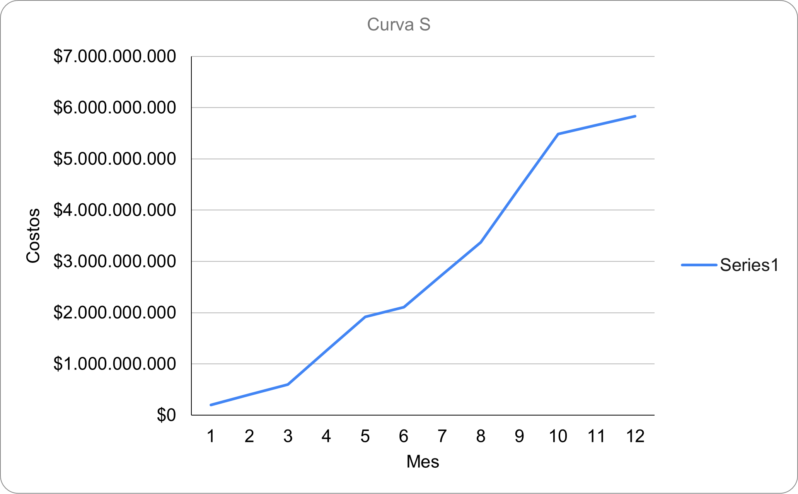

# Planeación del proyecto

La planeación del proyecto sigue la metodología de 7 pasos del Banco Interamericano de Desarrollo PM4R "Project Management for Results". 

## Metodología PM4R:
### 1. EDT
Primero, se realizó una EDT en conjunto con todos los integrantes del equipo. Esta EDT se puede visualizar con mayor detalle dentro de esta carpeta ([enlace](./EDT.png)).

### 2. Tiempos
Se siguió la metodología estimando los tiempos que durarán las tareas a realizar en el proyecto. Se siguió una formulación acorde al Excel ([enlace](./Tiempos.xlsx)).
### 3. Costos
Se calcularon los costos del proyecto y se analizaron en función del tiempo, como se muestra en la imagen:

El archivo [Curva_S.xlsx](./Curva_S.xlsx) muestra los cálculos detallados para representar los costos, los cuales tienen una forma de S como era de esperarse.
### 4. Adquisiciones
Para el cuarto paso se realizó una matriz de adquisiciones, la cual se puede evidenciar en el archivo [Adquisiciones.pdf](./Adquisiciones.pdf).
### 5. Riesgos
### 6. Comunicaciones
### 7. Matriz RACI

## CRM para gestión del proyecto: 
La herramienta elegida para relizar la planeación del proyecto es el CRM Clickup. Se eligió este CRM por la flexibilidad que ofrece al momento de generar tareas, con campos personalizados y la facilidad de realziar comentarios directamente en las tareas asignadas, permitiendo una comunicación más efectiva. 

## Cronograma en Diagrama de Gantt
Como resultado del segundo paso se presenta un cronograma en el diagrama de Gantt en el CRM Clickup
[Enlace al diagrama de Gantt en el CRM Clickup](https://sharing.clickup.com/9013028738/g/h/8ckftw2-653/38d6f748b8ea3fe)

En la siguiente imágen se puede observar que la herramienta fue muy útil para garantizar un orden de trabajo y conseguir los objetivos propuestos para esta primera entrega de trabajo. La técnica implementada para el desarrollo de las actividades fue fast tracking, la cual se basa en superposición de actividades ya que hubo la necesidad de avanzar en diferentes actividades a la vez para cumplir el requisito de otras. 

