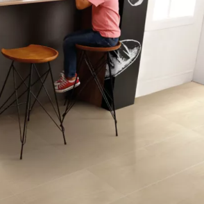
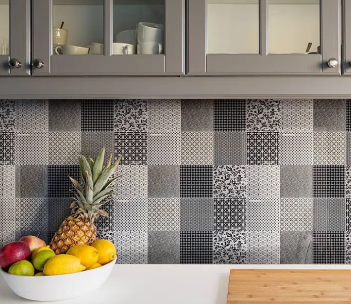
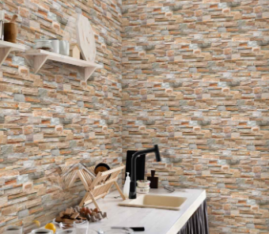
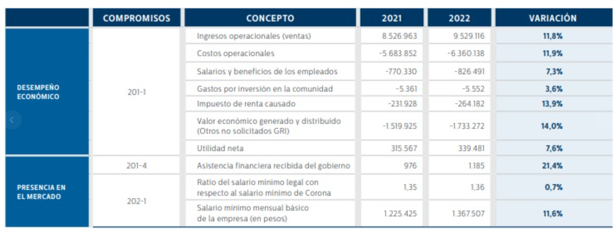

# Evaluación económica del proyecto

Se estudiará económicamente la viabilidad de este proyecto, para esto, se estimará la inversión inicial que se requiere en máquinas suponiendo que todas las máquinas se compran en el mes 0.

## Estimado de la inversión inicial por sistema

### Celda Robótica:

- **Robot:** US$25.000 a US$200.000 o más
- **Periféricos:** US$10.000 a US$50.000
- **Software:** US$5.000 a US$20.000
- **Integración:** US$10.000 a US$50.000
- **Total:** US$50.000 a US$320.000 o más

### Sistema SCADA:

- **Hardware:** US$5.000 a US$25.000
- **Software:** US$1.000 a US$10.000
- **Ingeniería e integración:** US$10.000 a US$50.000
- **Total:** US$16.000 a US$85.000

### Red de Comunicaciones:

- **Componentes de red:** US$500 a US$5.000
- **Ingeniería e integración:** US$2.000 a US$5.000
- **Total:** US$700 a US$10.000

### Nuevas máquinas

- **Nuevas decoradoras, bandas transportadoras y demás elementos de la planta**: US$500.000

### Total general estimado: US$1.000.000 

Se establece finalmente un valor de US$1.000.000 que corresponde a COP$4.000.000.000 aproximadamente de inversión inicial.

## Nómina para el proyecto

Este proyecto contará con los 7 ingenieros que conforman este grupo. Se asigna un salario de COP$8.000.000 mensuales por ingeniero, dado que son 7 ingenieros esto sería (mensual):

$$
S =  $8.000.000*7 = $56.000.000
$$

También se requiere mano de obra que cumpla la función de instalar, mover y transportar los diferentes equipos, para ellos se establece un salario promedio de $2.054.520 y se estima la contratación de 50 personas en este año de implementación del proyecto. Entonces el costo mensual de nómina por esta mano de obra es:

$$
S =  $2.054.520*50 = $102.726.000
$$

El costo total de la nómina mensual sería:

$$
C_{nom} =   $102.726.000 +  $56.000.000 = $158.726.000
$$

Lo que corresponde a  $1.904.712.000 de costos de nómina a lo largo de todo el año (12 meses).

La inversión total por el proyecto contando la inversión en máquinas y mano de obra corresponde a $5.805.674.803 (Año 0).

# Puesta en marcha

Ahora se calcularán los flujos de caja cuando la implementación haya acabado y esté puesta en marcha.

# Productos 

Según los productos definidos, se toman 3 referencias de estos en páginas del mercado para tener datos de precio, tamaño de lote, entre otros importantes para analizar económicamente el proyecto. Primero, se definirán los ingresos por ventas de cada producto según la productividad obtenida de las simulaciones.

## Producto 1 - Baldosa mate 30x60 cm

La referencia de este producto puede ser encontrada en este [enlace](https://www.homecenter.com.co/homecenter-co/product/395624/piso-pared-ceramico-avellano-beige-30x60cm-caja-162-m2/395624/?kid=goosho_1246419&shop=googleShopping&gad_source=1&gclid=CjwKCAjwz42xBhB9EiwA48pT7zUZUM5bbt577Q1XyNc6PeTEHuW5_orI4zHAUkWnBT5m6q9_t3lo5BoCgkIQAvD_BwE).

Esta tiene un precio por metro cuadrado de $41300. De la ficha técnica de este producto y de los resultados de la simulación, se obtienen los resultados mostrados en la siguiente tabla.

| Variable               | Valor         |
|------------------------|---------------|
| Tamaño lote (m^2)      |          1,62 |
| m^2 producidos         |     30.000,00 |
| Lotes producidos       |     18.518,52 |
| Precio de un lote      |       $66.906 |
| Lotes vendidos al mes  |   14814,81481 |
| Total ganancia mensual |  $991.200.000 |

Se establece un aproximado de lotes vendidos, donde este valor corresponde al 80% de lotes producidos. Todos esos datos son mensuales.

## Producto 2 - Baldosa esmaltada decorada 30x60 cm

La referencia de este producto puede ser encontrada en este [enlace](https://www.decorceramica.com/atelier-b-30-60-marengo-kc03me182/p).

Esta tiene un precio por metro cuadrado de $79519. De la ficha técnica de este producto y de los resultados de la simulación, se obtienen los resultados mostrados en la siguiente tabla.

| Variable               | Valor           |
|------------------------|-----------------|
| Tamaño lote (m^2)      |            1,44 |
| m^2 producidos         |       30.000,00 |
| Lotes producidos       |       20.833,33 |
| Precio de un lote      |        $114.507 |
| Lotes vendidos al mes  |     16666,66667 |
| Total ganancia mensual |  $1.908.456.000 |

## Producto 3 - Baldosa texturizada 30x60 cm

La referencia de este producto puede ser encontrada en este [enlace](https://corona.co/productos/revestimientos/paredes/pared-santa-maria/p/451419791).

Esta tiene un precio por metro cuadrado de $38300. De la ficha técnica de este producto y de los resultados de la simulación, se obtienen los resultados mostrados en la siguiente tabla.

| Variable               | Valor         |
|------------------------|---------------|
| Tamaño lote (m^2)      |          1,89 |
| m^2 producidos         |     15.000,00 |
| Lotes producidos       |      7.936,51 |
| Precio de un lote      |       $72.387 |
| Lotes vendidos al mes  |   6349,206349 |
| Total ganancia mensual |  $459.600.000 |

## Resumen de los productos

La siguiente tabla resume la información de ganancias de cada producto

| Producto | Mensual         | Anual            | % participación |
|----------|-----------------|------------------|-----------------|
|        1 |    $991.200.000 |  $11.894.400.000 |          29,51% |
|        2 |  $1.908.456.000 |  $22.901.472.000 |          56,81% |
|        3 |    $459.600.000 |   $5.515.200.000 |          13,68% |
| Total    |  $3.359.256.000 |  $40.311.072.000 |         100,00% |

Con esto, se establece un total de ventas de $40.311.072.000 anuales, se establece una tasa de crecimiento de ventas del 10% anual.

# Costos

## Materia prima

Debido al aumento esperado en la producción, se deberá adquirir más materia prima cuando la nueva planta esté puesta en marcha. Para esto se calcula la productividad de la planta actual y de la automatizada, obteniendo como resultado un aumento de 67262.4 m² mensuales. A partir de este dato, se estima que el costo de producir 1m² en materia prima es de $20000, por lo que mensualmente se obtiene que los costos de materias primas serían:

$$
C_{m} = $14.500*67262.4  $975.304.800,00
$$

Anualmente, serían $11.703.657.600,00 y se toma una tasa de aumento de precio del 10% anual.

## Costos de operación

Debido a que no se han definido máquinas aún, se toma como referencia el estado de resultados de la empresa Corona para el año 2021/2022 ilustrado en la siguiente imagen.

Se observa que los costos operacionales es el 66% del valor de las ventas, se toma entonces este valor para hacer un estimado de los costos operacionales obteniendo:

$$
C_{op} =  $40.311.072.000*0.66 = $26.605.307.520
$$

## Costos de nómina

De los VSM establecidos, se construyen las siguientes tablas que ilustran la cantidad de personal en cada etapa del proceso, para la planta actual se tiene un salario de MXN$300 diarios (datos de la empresa Castel) lo cual corresponde mensualmente a COP$2.054.520,00, en la planta actual, los costos de nómina se representan en la siguiente tabla:

| Proceso    | Cantidad de personal | Salario          |
|------------|----------------------|------------------|
| Prensado   |                    9 |   $18.490.680,00 |
| Esmaltado  |                    3 |    $6.163.560,00 |
| Impresión  |                    3 |    $6.163.560,00 |
| Horneado   |                    3 |    $6.163.560,00 |
| QC         |                    9 |   $18.490.680,00 |
| Empacado   |                   27 |   $55.472.040,00 |
| Paletizado |                   27 |   $55.472.040,00 |
| Total      |                    = |  $166.416.120,00 |

Para la planta automatizada, se tiene que:

| Proceso          | Cantidad de personal | Salario         |
|------------------|----------------------|-----------------|
| Prensado         |                    9 |  $18.490.680,00 |
| Esmaltado+Engobe |                    6 |  $12.327.120,00 |
| Impresión        |                    3 |   $6.163.560,00 |
| Horneado         |                    3 |   $6.163.560,00 |
| QC               |                    3 |   $6.163.560,00 |
| Empacado         |                    3 |   $6.163.560,00 |
| Paletizado       |                    3 |   $6.163.560,00 |
| Total            |                    = |  $61.635.600,00 |

Como se observa, los costos de nómina se ven reducidos, lo cual representa un ahorro que equivale a:

$$
C_{nom} = $166.416.120,00 - $61.635.600,00 = $104.780.520,00
$$

Anualmente equivale a COP$1.257.366.240, los salarios de los empleados aumentan el 10% cada año, por lo que este ahorro se verá reducido con el paso del tiempo.

# Depreciación de la maquinaria de la inversión inicial

Se establece una vida útil de 10 años para las máquinas compradas. Se toma un modelo de depreciación en línea recta con un valor de salvamento del 15% al final de su vida útil, obteniendo los siguientes resultados:

|        Indicador       |      Valor      |
|:----------------------:|:---------------:|
| Valor inicial          |  $4.000.000.000 |
| Valor de rescate (15%) |    $600.000.000 |
| Vida util (años)       |              10 |
| Depreciación anual     |    $340.000.000 |

# Gastos financieros e intereses

Se asumirá que el dinero proviene de fuentes diferentes de préstamos, por lo que el gasto financiero será de $0.

# Impuestos

Se tomará una tasa de 19% para impuesto sobre el EBITDA.

# Cálculo de indicadores

Sabiendo los flujos de caja y sus tasas de crecimiento, se calcula en excel los flujos netos anuales y acumulados. A partir de estos, se calculan los indicadores económicos y financieros para determinar la viabilidad del proyecto en esta hoja de  [excel](./EvalEconomica.xlsx).

En resumen, estos indicadores se pueden observar en la siguiente tabla.

|       Indicador      |       Valor      |
|:--------------------:|:----------------:|
| Costo de oportunidad |               5% |
| VP                   |  $30.546.718.896 |
| Inversión inicial    |   $5.805.674.803 |
| VPN                  |  $24.741.044.094 |
| TIR                  |              59% |
| Payback    (años)    |                2 |
| ROI                  |          398,57% |
| TIR (financiero)     |              42% |

Donde se observa que el proyecto es económicamente viable.

# Lista de Componentes

| Etapa         | Función                                    | Sensor/Actuador              | Cantidad | Referencia                                                                                                                                                                                 | Precio c/u (BT) | Precio Total | Precio (Con impuestos) |
|---------------|--------------------------------------------|------------------------------|----------|---------------------------------------------------------------------------------------------------------------------------------------------------------------------------------------------|-----------------|--------------|-----------------------|
| Prensado      | Medir la presión                           | Transductor de presión       | 1        | [WTsensor OEM ODM CE RoHS](https://www.alibaba.com/product-detail/WTsensor-OEM-ODM-CE-RoHS-4_1600536061273.html?spm=a2700.galleryofferlist.p_offer.d_image.21f74c47xIJKon&s=p)               | $143.202        | $143.202     | $186.163              |
|               | Detectar presencia                         | Sensor capacitivo            | 4        | Aotoro (Inductive Proximity Sensor)                                                                                                                                                          | $6.546          | $26.184      | $34.039               |
|               | Medir temperatura                          | Termopar                     | 2        | [GIMIDO Thermocouple](https://www.alibaba.com/product-detail/GIMIDO-Termopares-multipunto_1600978190398.html?spm=a2700.galleryofferlist.normal_offer.d_image.c73c7549zC5YOA)                   | $61.372         | $122.744     | $159.567              |
|               | Contar el tiempo de prensado - movimiento  | PLC                          | 1        | [PLC logo Siemens 6ED1052-1HB08-0BA1](https://www.alibaba.com/product-detail/Original-New-PLC-Logo-Siemens-6ED1052_1600702970426.html?spm=a2700.galleryofferlist.p_offer.d_image.33936efa4gNTbV&s=p) | $241.398        | $241.398     | $313.817              |
|               | Medir humedad                              | Higrómetro                   | 2        | [KEHAO](https://www.alibaba.com/product-detail/Wall-mounted-Temperature-And-Humidity-Sensor_1601046238114.html?spm=a2700.galleryofferlist.p_offer.d_image.540b1a228SliT0&s=p)                 | $171.021        | $342.042     | $444.655              |
|               | Act lineal movimiento en X y Y             | Cilindro doble efecto neumático | 5     | Cilindro Neumático Neumático Doble Efecto Aleación De Alumin                                                                                                                                 | $170.000        | $850.000     | $1.105.000            |
|               | Alimentación para actuador neumático       | Compresor de aire            | 1        | [3hp 2.2kw no noise scroll air compressor](https://www.alibaba.com/product-detail/Compressor-Good-Compressor-Portable-Silence-3hp_60552829824.html?spm=a2700.galleryofferlist.p_offer.d_image.54be65f3SxpoP1&s=p) | $2.495.815      | $2.495.815   | $3.244.560            |
|               | Movimiento de banda                        | Motor                        | 1        | [Drum Motor ZD Leader](https://www.alibaba.com/product-detail/Conveyor-Motor-ZD-Leader-50-60_60412179085.html?spm=a2700.galleryofferlist.p_offer.d_image.33ae2da3RfASLy&s=p)                   | $490.980        | $490.980     | $638.274              |
|               | Banda transportadora (Transporte de caja)  | Rodillo motorizado           | 3        | [Roller Conveyor SENTAO](https://www.alibaba.com/product-detail/SENTAO-New-Small-Stainless-Steel-Gravity_1600694690113.html?spm=a2700.shop_index.82.6.2cb338cbwimz3d)                        | $1.186.535      | $3.559.605   | $4.627.487            |
| Volteadora    | Posición y velocidad de rotación           | Servomotor                   | 1        | [StableCU](https://www.alibaba.com/product-detail/Three-phase-Permanent-Magnet-220v-Asynchronous_1600977742463.html?spm=a2700.galleryofferlist.p_offer.d_image.cfcc53d82OINaP&s=p)             | $474.600        | $474.600     | $616.980              |
|               | Detectar presencia                         | Sensor capacitivo            | 2        | Aotoro (Inductive Proximity Sensor)                                                                                                                                                          | $6.546          | $13.092      | $17.020               |
|               | Controlar movimiento                       | PLC                          | 1        | [PLC logo Siemens 6ED1052-1HB08-0BA1](https://www.alibaba.com/product-detail/Original-New-PLC-Logo-Siemens-6ED1052_1600702970426.html?spm=a2700.galleryofferlist.p_offer.d_image.33936efa4gNTbV&s=p) | $241.398        | $241.398     | $313.817              |
|               | Banda transportadora (Transporte de caja)  | Rodillo motorizado           | 3        | [Roller Conveyor SENTAO](https://www.alibaba.com/product-detail/SENTAO-New-Small-Stainless-Steel-Gravity_1600694690113.html?spm=a2700.shop_index.82.6.2cb338cbwimz3d)                        | $1.186.535      | $3.559.605   | $4.627.487            |
| Secadora      | Detectar presencia                         | Sensor capacitivo            | 2        | Aotoro (Inductive Proximity Sensor)                                                                                                                                                          | $6.546          | $13.092      | $17.020               |
|               | Medir tiempo de secado - movimiento        | PLC                          | 1        | [PLC logo Siemens 6ED1052-1HB08-0BA1](https://www.alibaba.com/product-detail/Original-New-PLC-Logo-Siemens-6ED1052_1600702970426.html?spm=a2700.galleryofferlist.p_offer.d_image.33936efa4gNTbV&s=p) | $241.398        | $241.398     | $313.817              |
|               | Medir Humedad                              | Higrómetro                   | 2        | [KEHAO](https://www.alibaba.com/product-detail/Wall-mounted-Temperature-And-Humidity-Sensor_1601046238114.html?spm=a2700.galleryofferlist.p_offer.d_image.540b1a228SliT0&s=p)                 | $171.021        | $342.042     | $444.655              |
|               | Banda transportadora (Transporte de caja)  | Rodillo motorizado           | 3        | [Roller Conveyor SENTAO](https://www.alibaba.com/product-detail/SENTAO-New-Small-Stainless-Steel-Gravity_1600694690113.html?spm=a2700.shop_index.82.6.2cb338cbwimz3d)                        | $1.186.535      | $3.559.605   | $4.627.487            |
|               | Movimiento de banda                        | Motor                        | 1        | [Drum Motor ZD Leader](https://www.alibaba.com/product-detail/Conveyor-Motor-ZD-Leader-50-60_60412179085.html?spm=a2700.galleryofferlist.p_offer.d_image.33ae2da3RfASLy&s=p)                   | $490.980        | $490.980     | $638.274              |
|               | Medir temperatura                          | Termopar                     | 4        | [GIMIDO Thermocouple](https://www.alibaba.com/product-detail/GIMIDO-Termopares-multipunto_1600978190398.html?spm=a2700.galleryofferlist.normal_offer.d_image.c73c7549zC5YOA)                   | $61.372         | $245.488     | $319.134              | |-------------------------|-------------------------------------------------|--------------------------------------------------------------|----------|-----------------------------------------------------------------------------------------------------------------------------------------------------------------|----------------|--------------|------------------|
| **Bifurcación**         | Cambio de dirección del transporte de cajas     | Banda Transportadora de bifurcación                           | 1        | [Roller Conveyor Line SENTAO](https://www.alibaba.com/product-detail/Metal-Powered-Driving-AVAILABLE-MOTOR-DRIVEN_1601113842447.html?spm=a2700.7735675.0.0.582f3ij63ij6rK&s=p)    | $1,432,025     | $1,432,025   | $1,861,633       |
|                         | Movimiento de banda                             | Motor                                                        | 1        | [Drum Motor ZD Leader](https://www.alibaba.com/product-detail/Conveyor-Motor-ZD-Leader-50-60_60412179085.html?spm=a2700.galleryofferlist.p_offer.d_image.33ae2da3RfASLy&s=p)     | $490,980       | $490,980     | $638,274         |
|                         | Detectar presencia de objeto                    | Sensores Capacitivo                                          | 2        | Aotoro (Inductive Proximity Sensor)                                                                                                                              | $6,546         | $13,092      | $17,020          |
| **Engobe**              | Detectar presencia                              | Sensor Capacitivo                                            | 4        | Aotoro (Inductive Proximity Sensor)                                                                                                                              | $6,546         | $26,184      | $34,039          |
|                         | Monitorear nivel de engobe                      | Sensor de nivel                                              | 2        | [Throw-in Type Liquid Level pressure Sensor](https://www.alibaba.com/product-detail/LEFOO-Throw-in-Submersible-Water-Level_1600647089522.html?spm=a2700.galleryofferlist.p_offer.d_image.71852b73d6qN1V&s=p) | $261,872       | $523,744     | $680,867         |
|                         | Viscosidad del engobe                           | Viscosímetro                                                 | 1        | [ZHYQ Inline Digital Display Vibration Viscosity Measurement Device](https://www.alibaba.com/product-detail/ZHYQ-Inline-Digital-Display-Vibration-Viscosity_1600798759787.html?spm=a2700.galleryofferlist.p_offer.d_image.66f768f7aBUCOu&s=p) | $27,823        | $27,823      | $36,170          |
|                         | Temperatura del engobe                          | Termopar                                                     | 2        | [GIMIDO Thermocouple](https://www.alibaba.com/product-detail/GIMIDO-Termopares-multipunto_1600978190398.html?spm=a2700.galleryofferlist.normal_offer.d_image.c73c7549zC5YOA)     | $61,372        | $122,744     | $159,567         |
|                         | Presión de aplicación                           | Transductor de presión                                       | 2        | [WTsensor OEM ODM CE RoHS 4-20mA 0.5 to 4.5V Water Gas Gauge](https://www.alibaba.com/product-detail/WTsensor-OEM-ODM-CE-RoHS-4_1600536061273.html?spm=a2700.galleryofferlist.p_offer.d_image.21f74c47xIJKon&s=p) | $143,202       | $286,404     | $372,325         |
|                         | Velocidad de aplicación                         | Encoder                                                      | 2        | [S38 encoder 100/200/360/400/600/1000P/R DC 5V-24V](https://www.alibaba.com/product-detail/Encoder-S38-Encoder-100-200-360_1600874903218.html?spm=a2700.galleryofferlist.p_offer.d_image.7b0f289eCJmzZB&s=p) | $158,810       | $317,620     | $412,906         |
|                         | Bomba de engobe                                 | Bomba Peristáltica                                           | 1        | [WODETEC Electric Industrial Peristaltic Pump](https://www.alibaba.com/product-detail/electric-Industrial-peristaltic-pump-for-ceramic_1601108178291.html?spm=a2700.galleryofferlist.p_offer.d_image.24332a490L9mti&s=p) | $14,322,000    | $14,322,000  | $18,618,600      |
|                         | Sistema de mezcla                               | Agitador eléctrico                                           | 1        | [HONGXIN ADM128 2 HP Direct Drive Clamp Mount](https://www.alibaba.com/product-detail/ADM128-2-HP-Direct-Drive-Clamp_62061648386.html?spm=a2700.galleryofferlist.p_offer.d_image.3c8e23a2wWBdFf&s=p) | $1,841,400     | $1,841,400   | $2,393,820       |
| **Esmaltado**           | Detectar presencia                              | Sensor Capacitivo                                            | 4        | Aotoro (Inductive Proximity Sensor)                                                                                                                              | $6,546         | $26,184      | $34,039          |
|                         | Monitorear nivel de engobe                      | Sensor de nivel                                              | 2        | [Throw-in Type Liquid Level Pressure Sensor](https://www.alibaba.com/product-detail/LEFOO-Throw-in-Submersible-Water-Level_1600647089522.html?spm=a2700.galleryofferlist.p_offer.d_image.71852b73d6qN1V&s=p) | $261,872       | $523,744     | $680,867         |
|                         | Viscosidad del engobe                           | Viscosímetro                                                 | 1        | [ZHYQ Inline Digital Display Vibration Viscosity Measurement Device](https://www.alibaba.com/product-detail/ZHYQ-Inline-Digital-Display-Vibration-Viscosity_1600798759787.html?spm=a2700.galleryofferlist.p_offer.d_image.66f768f7aBUCOu&s=p) | $27,823        | $27,823      | $36,170          |
|                         | Temperatura del engobe                          | Termopar                                                     | 2        | [GIMIDO Thermocouple](https://www.alibaba.com/product-detail/GIMIDO-Termopares-multipunto_1600978190398.html?spm=a2700.galleryofferlist.normal_offer.d_image.c73c7549zC5YOA)     | $61,372        | $122,744     | $159,567         |
|                         | Presión de aplicación                           | Transductor de presión                                       | 2        | [WTsensor OEM ODM CE RoHS 4-20mA 0.5 to 4.5V Water Gas Gauge](https://www.alibaba.com/product-detail/WTsensor-OEM-ODM-CE-RoHS-4_1600536061273.html?spm=a2700.galleryofferlist.p_offer.d_image.21f74c47xIJKon&s=p) | $143,202       | $286,404     | $372,325         |
|                         | Velocidad de aplicación                         | Encoder                                                      | 2        | [S38 Encoder 100/200/360/400/600/1000P/R DC 5V-24V](https://www.alibaba.com/product-detail/Encoder-S38-Encoder-100-200-360_1600874903218.html?spm=a2700.galleryofferlist.p_offer.d_image.7b0f289eCJmzZB&s=p) | $158,810       | $317,620     | $412,906         |
|                         | Bomba de engobe                                 | Bomba Peristáltica                                           | 1        | [WODETEC Electric Industrial Peristaltic Pump](https://www.alibaba.com/product-detail/electric-Industrial-peristaltic-pump-for-ceramic_1601108178291.html?spm=a2700.galleryofferlist.p_offer.d_image.24332a490L9mti&s=p) | $14,322,000    | $14,322,000  | $18,618,600      |
|                         | Sistema de mezcla                               | Agitador eléctrico                                           | 1        | [HONGXIN ADM128 2 HP Direct Drive Clamp Mount](https://www.alibaba.com/product-detail/ADM128-2-HP-Direct-Drive-Clamp_62061648386.html?spm=a2700.galleryofferlist.p_offer.d_image.3c8e23a2wWBdFf&s=p) | $1,841,400     | $1,841,400   | $2,393,820       |
| |-------------------------|-----------------------------------------------|--------------------------------------------------------------|--------------|---------------------------------------------------------------------------------------------------------------------------------------------------------------------------------------------------------------------------------------------------------|--------------------|-----------------|----------------------|
| **Unión de la bifurcación** | Cambio de dirección del transporte de cajas  | Banda Transportadora de bifurcación                          | 1            | [Roller Conveyor Line SENTAO](https://www.alibaba.com/product-detail/Metal-Powered-Driving-AVAILABLE-MOTOR-DRIVEN_1601113842447.html?spm=a2700.7735675.0.0.582f3ij63ij6rK&s=p)                                                                          | $1,432,025         | $1,432,025      | $1,861,633           |
|                         | Movimiento de banda                           | Motor                                                        | 1            | [Drum Motor ZD Leader](https://www.alibaba.com/product-detail/Conveyor-Motor-ZD-Leader-50-60_60412179085.html?spm=a2700.galleryofferlist.p_offer.d_image.33ae2da3RfASLy&s=p)                                                                             | $490,980           | $490,980        | $638,274             |
|                         | Detectar presencia de objeto                  | Sensores Capacitivo                                          | 2            | Aotoro (Inductive Proximity Sensor)                                                                                                                                                                                                                      | $6,546             | $13,092         | $17,020              |
| **Decoradora**          | Control de tinta                              | Válvula solenoide                                            | 2            | [Mingge 4V220 24V 110V 220V 5/2 Way 5/3 Way Pneumatic Air Valve](https://www.alibaba.com/product-detail/4V220-24V-110V-220V-5-2_1600719653792.html?spm=a2700.galleryofferlist.p_offer.d_image.2fa240b94Omqwa&s=p)                                      | $20,443            | $40,886         | $53,152              |
|                         | Banda transportadora                          | Rodillo motorizado                                           | 3            | [Roller Conveyor SENTAO](https://www.alibaba.com/product-detail/SENTAO-New-Small-Stainless-Steel-Gravity_1600694690113.html?spm=a2700.shop_index.82.6.2cb338cbwimz3d)                                                                                    | $1,186,535         | $3,559,605      | $4,627,487           |
|                         | Movimiento de a banda                         | Motor                                                        | 1            | [Drum Motor ZD Leader](https://www.alibaba.com/product-detail/Conveyor-Motor-ZD-Leader-50-60_60412179085.html?spm=a2700.galleryofferlist.p_offer.d_image.33ae2da3RfASLy&s=p)                                                                             | $490,980           | $490,980        | $638,274             |
|                         | Sensor de presencia                           | Sensor Capacitivo                                            | 2            | Aotoro (Inductive Proximity Sensor)                                                                                                                                                                                                                      | $6,546             | $13,092         | $17,020              |
|                         | Nivel de tinta                                | Sensor de nivel                                              | 2            | [Throw-in Type Liquid Level pressure Sensor](https://www.alibaba.com/product-detail/LEFOO-Throw-in-Submersible-Water-Level_1600647089522.html?spm=a2700.galleryofferlist.p_offer.d_image.71852b73d6qN1V&s=p)                                            | $261,872           | $523,744        | $680,867             |
| **Horneado**            | Temperatura de horno                          | Termocupla                                                   | 4            | [MICC - k type thermocouple 1200 degree mineral insulated hot joint S single (2 wires) thermocouple](https://www.alibaba.com/product-detail/k-type-thermocouple-1200-degree-mineral_62325974669.html?spm=a2700.galleryofferlist.normal_offer.d_image.28ab3e512gxXAN) | $40,881            | $163,524        | $212,581             |
|                         | Sensor de presencia                           | Sensor capacitivo                                            | 2            | Aotoro (Inductive Proximity Sensor)                                                                                                                                                                                                                      | $6,546             | $13,092         | $17,020              |
|                         | Tiempo de cocción                             | PLC                                                          | 1            | [PLC logo Siemens 6ED1052-1HB08-0BA1 DI 8/DO 4 logic module LOGO! 24RCE](https://www.alibaba.com/product-detail/Original-New-PLC-Logo-Siemens-6ED1052_1600702970426.html?spm=a2700.galleryofferlist.p_offer.d_image.33936efa4gNTbV&s=p)                  | $241,398           | $241,398        | $313,817             |
|                         | Humedad                                       | Higrómetro                                                   | 2            | [KEHAO](https://www.alibaba.com/product-detail/Wall-mounted-Temperature-And-Humidity-Sensor_1601046238114.html?spm=a2700.galleryofferlist.p_offer.d_image.540b1a228SliT0&s=p)                                                                            | $171,021           | $342,042        | $444,655             |
|                         | Banda transportadora                          | Rodillos motorizado                                          | 3            | [Roller Conveyor SENTAO](https://www.alibaba.com/product-detail/SENTAO-New-Small-Stainless-Steel-Gravity_1600694690113.html?spm=a2700.shop_index.82.6.2cb338cbwimz3d)                                                                                    | $1,186,535         | $3,559,605      | $4,627,487           |
|                         | Movimiento de a banda                         | Motor                                                        | 1            | [Drum Motor ZD Leader](https://www.alibaba.com/product-detail/Conveyor-Motor-ZD-Leader-50-60_60412179085.html?spm=a2700.galleryofferlist.p_offer.d_image.33ae2da3RfASLy&s=p)                                                                             | $490,980           | $490,980        | $638,274             |
| **Control de calidad**  | Calidad de tamaño                             | Instrumento de medición automático                           | 2            | [Hong Jin- Fully Automatic Two-Dimensional Measuring Instrument Optical Image Measuring Instrument Video Measuring Instrument](https://www.alibaba.com/product-detail/Fully-Automatic-Two-Dimensional-Measuring-Instrument_1600989798772.html?spm=a2700.galleryofferlist.p_offer.d_image.2fec6acfFWWwQW&s=p) | $17,660,721        | $35,321,442     | $45,917,875          |
| **Apiladora**           | Apilar las baldosas                           | Máquina apiladora                                            | 1            | SACMI                                                                                                                                                                                                                                                    | $200,000,000       | $200,000,000    | $260,000,000         |
| **Empaquetado**         | Empacar las baldosas en cajas                 | Máquina empacadora                                           | 1            | SACMI                                                                                                                                                                                                                                                    | $200,000,000       | $200,000,000    | $260,000,000         |
| **Paletizado (Celda robótica)** | Paletizado de cajas                        | Celda Gantry                                                 | 1            | Diseño propio                                                                                                                                                                                                                                            | $500,000,000       | $500,000,000    | $650,000,000         |
|                         | Transporte de cajas                           | AMR                                                          | 4            | AMR                                                                                                                                                                                                                                                      | $280,000,000       | $1,120,000,000  | $1,456,000,000       |
| **Comunicaciones industriales** | Controlador                              | PLC                                                          | 5            | Control Logix 1665                                                                                                                                                                                                                                       | $10,000,000        | $50,000,000     | $65,000,000          |
|                         | Conexiones                                    | Cables                                                       | 1            | Varios                                                                                                                                                                                                                                                   | $4,000,000         | $4,000,000      | $5,200,000           |
|                         | Instalación de hardware                       | Tablero y seguridad                                          | 5            | Varios                                                                                                                                                                                                                                                   | $3,000,000         | $15,000,000     | $19,500,000          |
|                         | Instalación de tableros                       | Ingeniero que instale tableros                               | 2            | Varios                                                                                                                                                                                                                                                   | $4,500,000         | $9,000,000      | $11,700,000          |
| **Software**            | Layout de la planta en Tecnomatix             | Tecnomatix                                                   | 7            | -                                                                                                                                                                                                                                                        | $8,000,000         | $56

  
