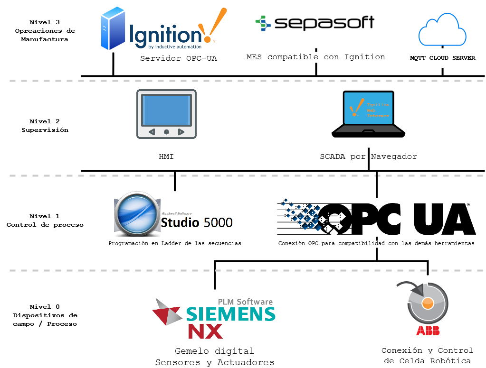

# Industria 4.0 y transformación Digital

Como parte del proyecto, nuestro equipo aspira poder realizar una integración directa con las ventas realizadas a nuestros clientes, y nuestra línea de producción, permitiendo agregar valor por medio de cerámica personalizada con un patrón que pueda formarse empleando varias baldosas. Este servicio busca innovar en la industria cerámica aprovechando las tecnologías de impresión con tintas Kerajet que podrían facilitar emplear diseños de nuestros clientes a nuestra planta de producción. Para ello, hemos planteado la siguiente arquitectura de comunicaciones: 

Es importante aclarar que conforme avance el proyecto, se ajustará el diagrama de arquitectura acorde a los cambios que sean necesarios para implementar toda la arquitectura. Dicho esto, esta estructura de Industria 4.0 es apenas un borrador de lo que se planea hacer con el proyecto.
